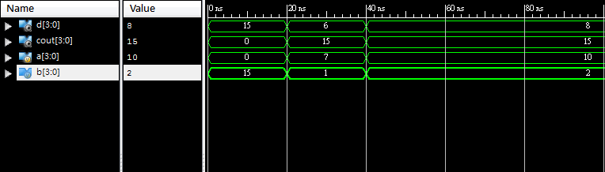
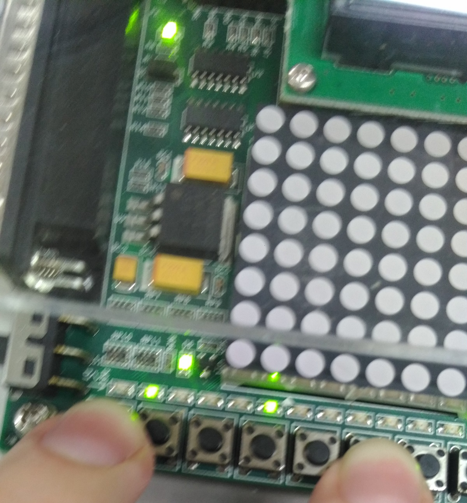
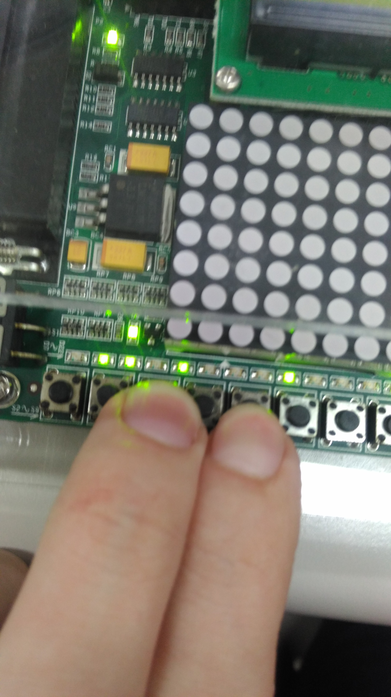

### 題目
只要將1位元的全加器寫好，之後再主程式呼叫四個將其串起便可形成四位元全加器。
  ```verilog
  module fa(s,cout,a,b,cin);
  output s,cout;
  input a,b,cin;
  assign s=a^b^cin;
  assign cout = (a&b) | (cin&(a^b));
  endmodule
  ```

最外層:


中間層:


模擬波型:



要注意的點是板子和程式是位元相反的。代表說在模擬時1會變0、0會變1。故模擬檔寫好後確定沒問題時要燒進板子前須要做位元轉換。



A = 1000 、 B = 0100 所以亮的是0100為四。



A = 0010 、 B = 1000 答案為-6故亮0110且負號燈也亮起。
