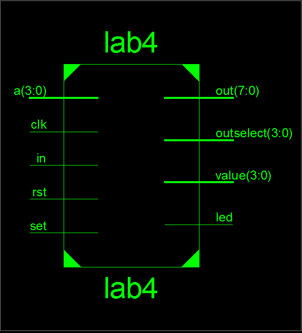
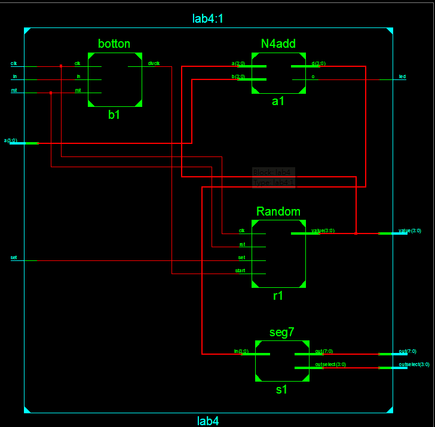
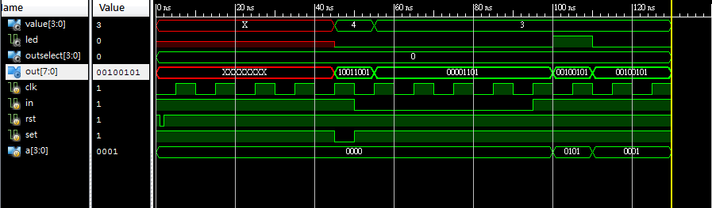

 ### [題目](https://github.com/stormteeth/FPGA-#lab-4)
 這次的題目最主要的部份在隨機產生亂數，由於電腦世界中沒有所謂的亂數但在打C的時候可以使用內建的亂數表來取亂數。但我們ISE14.7是沒有亂數表的所以我們需要自己寫一個類似亂數表功能的Block
 
```verilog
always@(posedge clk or negedge rst)begin
   if(~rst)
      seedcnt <= 4'd0;
   else 
      seedcnt <= seedcnt+1;
end
always@(posedge start or negedge set)begin
   if(~set)
      value<=seedcnt;
   else begin
      if(value==4'd0)
         value<=seedcnt;
      else begin
         value[0]<=value[3]^value[2];
         value[1]<=value[2]^value[1];
         value[2]<=value[1]^value[0];
         value[3]<=value[0]^value[3];
      end 
   end  
end
```
這裡的寫法是先用CLK計數，當我們按下set時會給value seedcnt計數到的值，而當我們按下start時會將紀錄在value的3與2位元值、2與1位元值...以此類推進行互斥或，以seedcnt為基底來產生一個亂數。

最外層:



中間層:



模擬波型:


