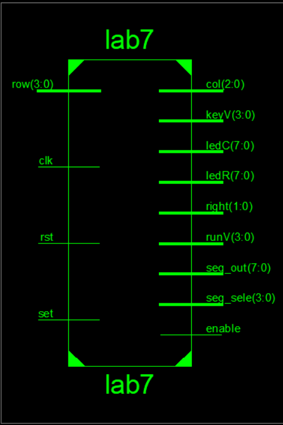
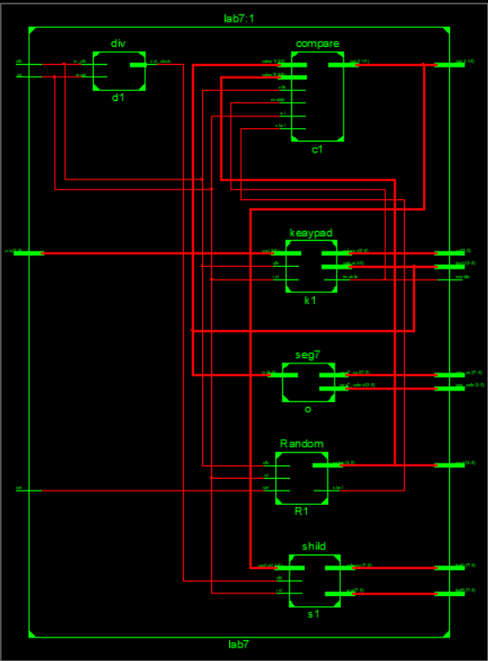
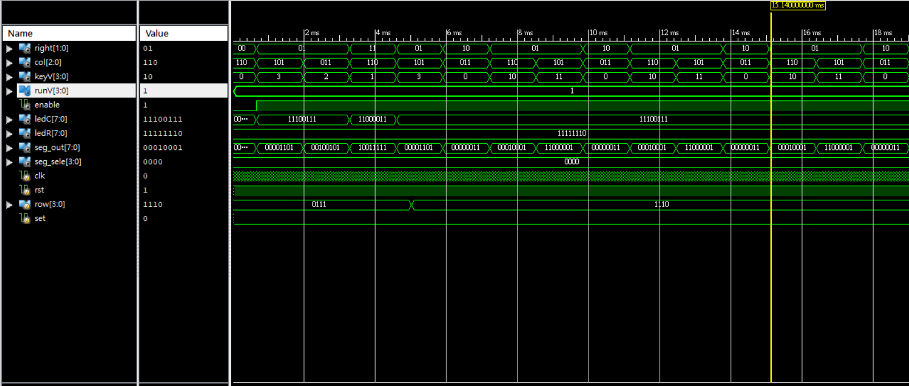
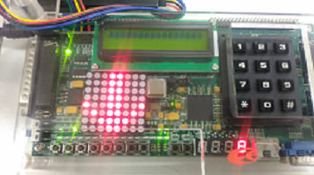
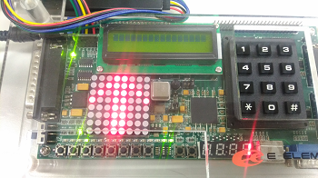
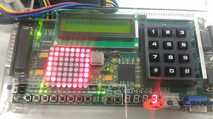

 ### [題目](https://github.com/stormteeth/FPGA-#lab-7)
 Lab7.pdf非本人撰寫
 
 這次的Lab用到的模組為鍵盤模組來製作猜數字小遊戲。Lab7.pdf已詳細說明。
 
 最外層:
 
 
 
 中間層:
 
 
 
 模擬波型:
 
 
 
 
 
 猜的數字比正確答案還大
 
 
 
 猜的數字比正確答案還小
 
 
 
 猜中隨機取號的數字
 
 
