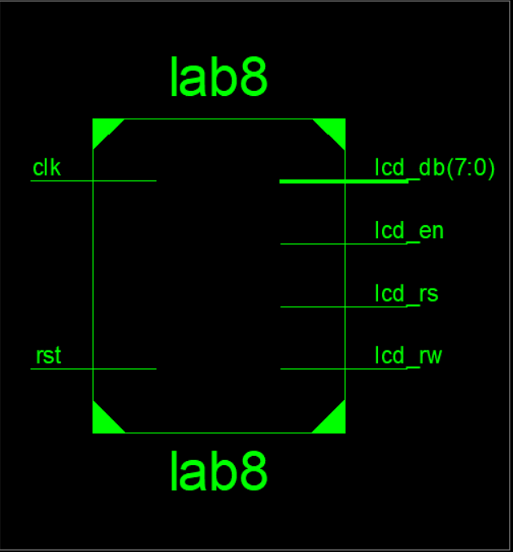
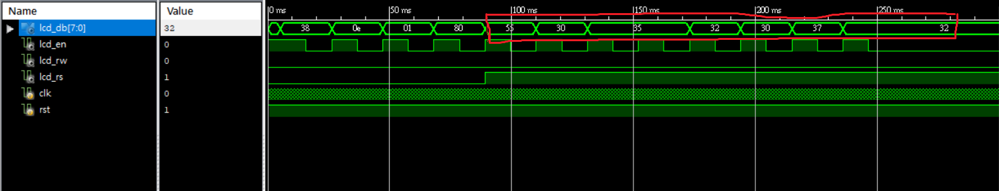
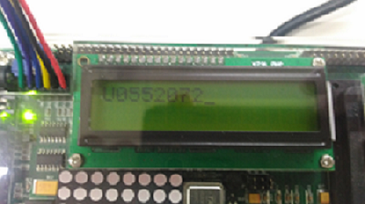

 ### [題目](https://github.com/stormteeth/FPGA-#lab-8)
 Lab8.pdf非本人撰寫
 
 這次的Lab用到的模組為LCD顯示器模組來製作顯示自己的學號。Lab8.pdf已說明部分LCD功能。
 
 本次Lab可分成兩個部份來說明，第一部分為前面設定要顯示的字元。第二部分為設定FPGA上的LCD來進行顯示。
 ```verilog
 wire [7:0]romdata[7:0];
 assign romdata[0]=8'h55;
 assign romdata[1]=8'h30;
 assign romdata[2]=8'h35;
 assign romdata[3]=8'h35;
 assign romdata[4]=8'h32;
 assign romdata[5]=8'h30;
 assign romdata[6]=8'h37;
 assign romdata[7]=8'h32;
 ```
 前面assign了一個8個8位元的陣列來儲存我們要顯示字元的16進制。可以看到我們的FSM總共拆分成兩個來寫一個是寫我們LCD設定的過程，另一個為該模式下需要輸入的訊號準位。對於需要輸入甚麼才能控制LCD在Lab8.pdf上已說明。
 ```verilog
 //----Mode Command--------
 setup_mode:state<=write_mode;
 write_mode:state<=setup_display;
 //----Display Command-----
 setup_display:state<=write_display;
 write_display:state<=setup_clear;
 //----Clear Command-------
 setup_clear:state<=write_clear;
 write_clear:state<=setup_position;
 //----Position Command----
 setup_position:state<=write_position;
 write_position:state<=setup_data;
 //----Data----------------
 setup_data:state<=write_data;
 write_data:begin
    if(datacnt<4'd7)begin
	     datacnt<=datacnt+1;
	     state<=setup_data;
	  end
	  else
	     state<=state;
 end
 ```
 最外層:
 
 
 
 模擬波型:
 
 
 
 
 
 顯示學號
 
 
