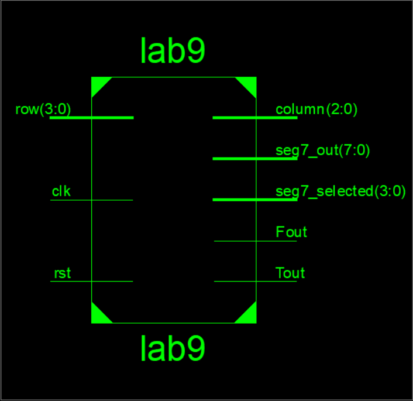
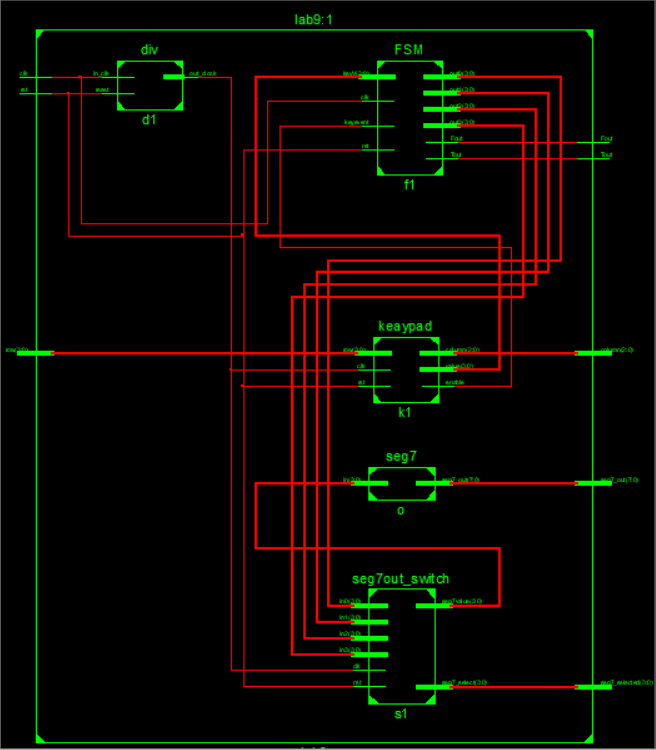
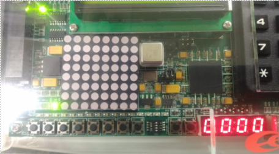
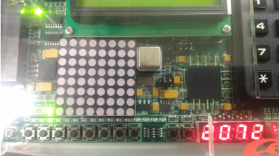
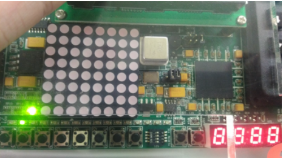

### [題目](https://github.com/stormteeth/FPGA-#lab-9)
這次的Lab為利用自己學號末4碼當作密碼鎖的密碼，主要block為輸入數字的keypad和用來顯示我們keypad所按的數字的七段顯示器和兩個判斷完後顯示是對還錯的LED燈。

為了避免我們一按keypad就讓四位元全都變成第一個按的數字，所以需要對keypad做除彈跳以確保不會出錯。當我們把四個數字都輸入後我們的FSM會判斷密碼是否為真，若是對的True為1、False為0，反之亦然。

最外層:

中間層:

清除為0，沒有對比

密碼正確，第三個的True燈亮起。

密碼錯誤，第二個的False燈亮起。
