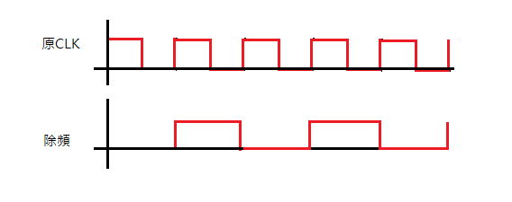
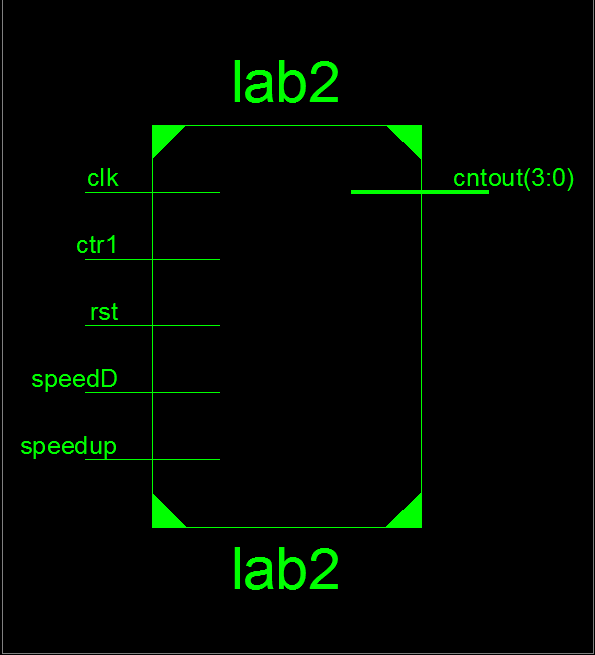
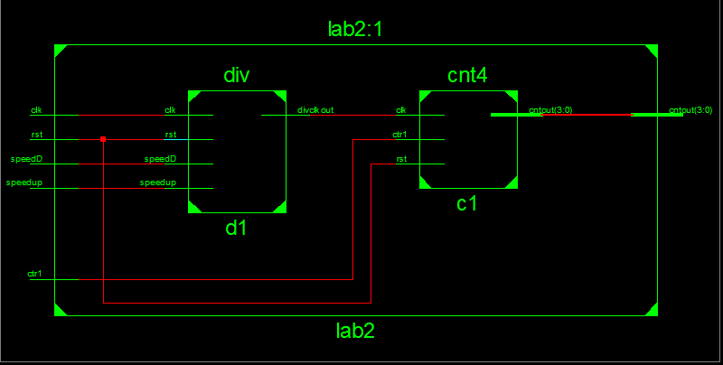
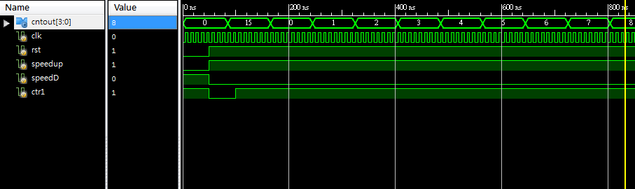

### [題目](https://github.com/stormteeth/FPGA-#lab-2)
這題最主要的部份是控制FPGA版的時脈，這題提到了加速與減速故我將一秒設為正常速度。

在繼續之前需要提到一個概念那便是除頻器，我們假設我們的震盪晶片是1Hz，所以他每秒會加一。以下面程式碼來說我們給了divclk 5個位元，從0到15所以正常跑完需要16秒。
  ```verilog
  output divclkout;
  input clk;
  reg [4:0] divclk;
  reg speed = 1'b1;
  assign divclkout = divclk[speed];
  always@(posedge clk)begin
      divclk <= divclk + 1'd1;
  end
  ```
  那如果我們在編寫時以一個暫存來計數clock便可調整我們的速度speed便是指我們的divclkout是根據divclk的第二個位元來輸出的
  
  
  
  可以看到原clk已經跑了四個周期但新的clk才跑了兩個周期可以看出我們的頻率比之前慢兩倍，這便是我們的除頻電路

以這塊板子來說其自帶的震盪晶片頻率為40MHz，故我們在設計除頻器時是以2的次方倍來計算的。40M代表他每2.5e-8加1，那他加2千萬次便可接近我們真實世界的1秒。之後以週期來看整個週期為1，故2千萬/2=1千萬，2的24次方左右最接近所以我們取這個範圍來模擬。

最外層:



中間層:



模擬波型:



