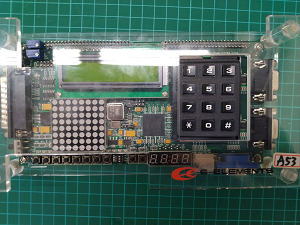

# FPGA-
將在大二下時所學的FPGA紀錄於此，使用軟體:ISE14.7來撰寫。PING.pdf非本人所撰寫。

ISE14.7設定FPGA晶片:
|||
|-------|------------------------:|
|Family |Spartan3A and Spartan3AN |
|Device |     XC3S200AN           |
|Package|     FTG256              |
|Speed  |      -4                 |

FPGA外觀:

## Lab 1
1. 利用4 bits Ripple Carry Full Adder並使用邏輯閘實現4 bits 正整數全減器並輸出結果。
    #### [答案](https://github.com/stormteeth/FPGA-/tree/main/Lab%201)
## Lab 2
1. 將4 bit 上數計數器，增加三支腳位作為改變除頻頻率、與切換上下數的功能，並使用模擬並輸出結果。
    * Speed+ 按下時頻率變快2倍，放開變回原頻率
    * Speed- 按下時頻率變慢2倍，放開變回原頻率
    * Ctrl 按下時切換成下數模式，放開則為上數
    #### [答案](https://github.com/stormteeth/FPGA-/tree/main/Lab%202)
## Lab 3
1. 實作以下區塊圖電路；4Bits FA為Lab1；4 Bits Counter為Lab2；Ctrl為控制 Counter上下數，1為上數，0為下數；in 0為按下，1為沒按；將 Button的 輸出當作Counter的Clock輸入，每一個Button的觸發可觸動Counter上 數或下 數，計數器的輸出跟A[3:0]相減後做輸出。
    #### [答案](https://github.com/stormteeth/FPGA-/tree/main/Lab%203)
## Lab 4
1. 實作以下區塊圖電路；將練習中所產生的值0至255縮減為0至15。按下in按鈕(防彈跳)取一亂數值當作全減器(lab1)的被減數，並用LED顯示。而4bit b按鈕為全減器(lab1)的減數，將2數相減後用七段顯示器做輸出，另負數燈用LED顯示。
    #### [答案](https://github.com/stormteeth/FPGA-/tree/main/Lab%204)
## Lab 5
1. 將Seccnt利用七段做顯示(計數的秒數);3種狀態紅燈9秒；綠燈6秒；黃燈3秒，並且可以利用speed dwon/up 控制速度(原速度設定為 tmp[25]) 需加入防彈跳
   * Speedup 按下時頻率變快4倍，放開變回原頻率
   * Speeddwon 按下時頻率變慢4倍，放開變回原頻率
    #### [答案](https://github.com/stormteeth/FPGA-/tree/main/Lab%205)
## Lab 6
1. 將Lab5 紅綠燈狀態機秒數改成下數，並利用七段做顯示; 將四種狀態000,100,010,001，用LED Matrix做不同狀態(初始化，R，Y，G)輸出。
    #### [答案](https://github.com/stormteeth/FPGA-/tree/main/Lab%206)
